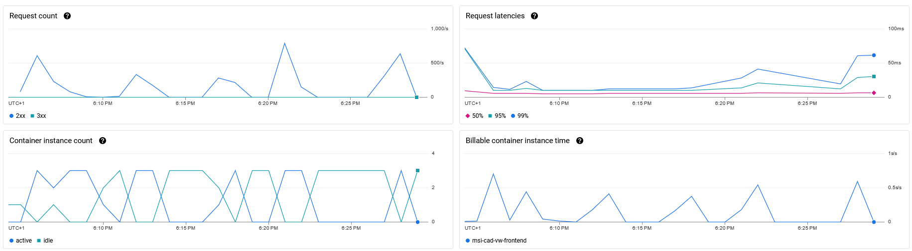
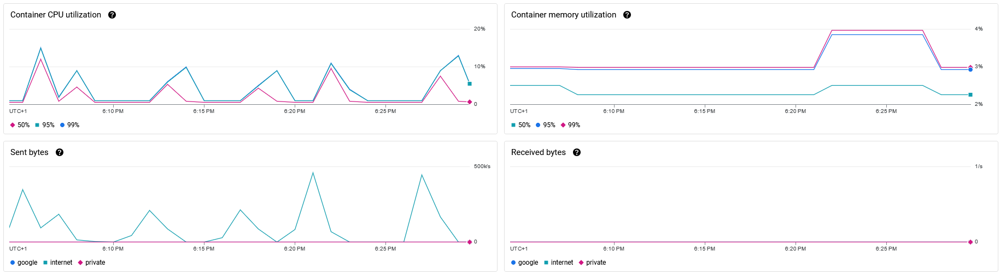
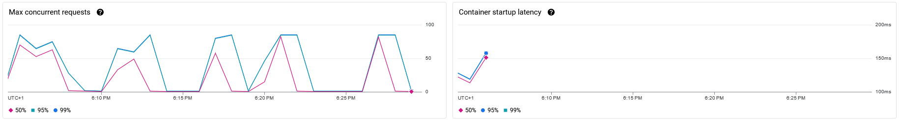
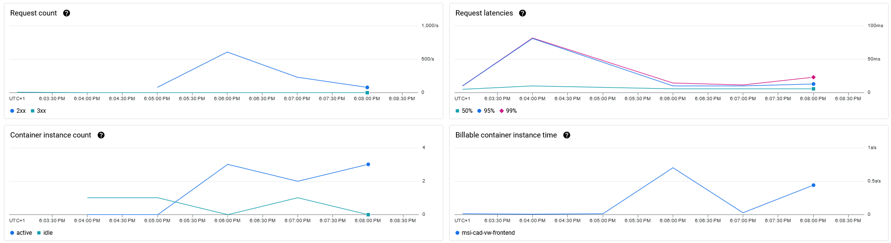
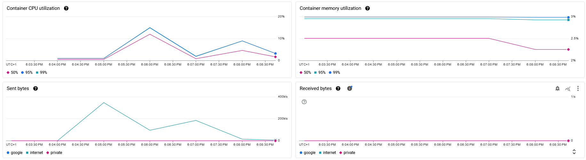
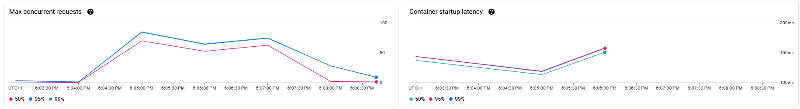
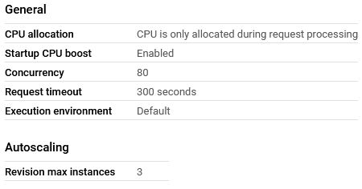

# Load Testing using Locust

This is the documentation of the load testing for the Parking Management. 

## Locust

For load testing our web page, we used Locust, an open-source tool designed for simulating high-traffic conditions on web applications. Locust allows developers and testers to define custom user behaviors in Python, enabling scalable testing to assess how a system performs under varying levels of concurrent user load. With Locust, we can identify performance bottlenecks, optimize resource usage, and ensure that the application is ready to handle anticipated traffic.

## First Scenario: Continuously Changing Workload

The first load test is the **Continuously Changing Workload** test, a dynamic approach where the number and behavior of users vary over time. Instead of maintaining a steady load, this test simulates changing user activity to mimic real-world traffic patterns. It helps assess how well our web page adapts to fluctuating user demands, revealing performance limits and resource usage efficiency under different conditions.

### Load Test

In this test, we introduced different numbers of users to our web page at varying ramp-up intervals to assess how our application would respond under changing loads. This approach allowed us to observe the system's performance and stability as user traffic gradually increased, providing insight into how well the application handles surges in activity and adapts to fluctuating demands.

### Results

Here, we present four graphs that visualize the results from our continuously changing workload test, focusing on Request Count, Request Latencies, Container Instance Count, and Billable Container Instance Time.

The first graph illustrates the request count, displaying the varying numbers of users accessing our web page. It clearly depicts how this number fluctuates over time, highlighting the increases and decreases in user traffic per second.

The second graph presents the request latencies, featuring three different latency percentiles: 50%, 95%, and 99%. The 50% latency remains consistently low throughout the entire test scenario. In contrast, the 95% and 99% latencies initially rise to approximately 70 ms before dropping to a lower value, where they remain stable for a brief period. Toward the end of the test, the two latencies diverge slightly, but overall, they exhibit similar behavior—rising, slowing down, and then spiking again at the conclusion of the test. The consistently low 50% latency indicates that half of the requests are processed quickly. However, the behavior of the 95% and 99% latencies suggests that while most requests are handled efficiently, a subset of requests experiences longer processing times. The initial spike to approximately 70 ms may indicate moments of strain on the system, likely correlating with increased user traffic.

The third graph visualizes the container instance count, displaying two distinct states: active and idle. The active state increases in response to a surge of users, peaking at three containers, and then decreases to zero when there are no users. The active state’s increase during user influx demonstrates the application’s ability to scale resources effectively to meet demand, reaching a maximum of three active containers. This responsiveness is crucial for maintaining performance during peak usage. Conversely, the idle state's behavior, rising to three containers when user activity is low, suggests that resources are being efficiently utilized without unnecessary waste.

The fourth and final graph illustrates the billable container instance time, revealing how costs are associated with user activity on our web application. The graph’s rise during periods of increased user traffic indicates that resource utilization directly correlates with demand, reflecting the operational costs incurred during high-traffic moments. Notably, the peak of 0.7 s/s suggests that while resource usage is efficient, there is a cap on the billable time per instance.

These four graphs illustrate the results related to Container CPU Utilization, Container Memory Utilization, Sent Bytes, and Received Bytes.

The first graph visualizes Container CPU Utilization, displaying three percentiles: 50%, 95%, and 99%. All three percentiles exhibit similar behavior, rising in response to increased user activity and falling when user counts decrease. The maximum CPU utilization reaches 15%, while the minimum dips to 1%. This observation indicates that the container's CPU utilization is relatively efficient and responds predictably to changes in user demand. The consistent behavior across the 50%, 95%, and 99% percentiles suggests that the application can handle varying loads without significant strain on the CPU. 

The second graph illustrates Container Memory Utilization, featuring three different percentiles: 50%, 95%, and 99%. The 50% percentile remains relatively low, with a maximum value of 2.5% and a minimum of 2.3%. In contrast, the 95% and 99% percentiles exhibit similar behavior, maintaining a steady level around 3% before peaking at 4% toward the end of the test and then returning to 3%. This observation highlights the effective management of memory resources within the container environment. The consistently low 50% percentile suggests that the majority of memory requests are being efficiently handled, indicating minimal strain during regular operations.

The third and fourth graphs display the sent and received bytes during the load test, categorized into three sources: Google, Internet, and Private. The data indicates that as the user count increases, the sent bytes from the Internet source also rise significantly, while the sent bytes from Google and Private sources remain at zero throughout the test. Notably, there were no received bytes recorded for any of the three sources — Google, Internet, or Private — at any point during the load test.

The final two graphs illustrate the results of the continuously changing workload test, focusing on the maximum number of concurrent requests and the latency associated with container startup.

The first graph depicts the maximum concurrent requests, highlighting three distinct percentiles: 50%, 95%, and 99%. All three percentiles exhibit similar behavior, increasing as the user count rises and decreasing as the user count declines. Each percentile peaks at a maximum of 80 concurrent requests and reaches a minimum of zero. The consistent patterns observed in the three percentiles suggest a direct correlation between user count and the system's ability to handle concurrent requests. As user demand increases, the system efficiently scales up to accommodate more requests, with a maximum threshold of 80 concurrent requests reached across all percentiles. Conversely, when user demand decreases, the number of concurrent requests drops accordingly.

The second graph displays the container startup latency, featuring three different percentiles: 50%, 95%, and 99%. All three percentiles exhibit similar behavior, starting at approximately 120 ms, then decreasing to around 110 ms before quickly rising to approximately 155 ms. The patterns observed in the container startup latency indicate that there is an initial period of quick response when launching containers, as shown by the drop from 120 ms to 110 ms. This suggests that the system is efficient at starting up containers under lower load conditions. However, the subsequent rapid increase to 155 ms indicates a potential bottleneck or delay when scaling up, which may occur as the system is required to manage higher demands or resource allocation during peak usage. The similarity in behavior among the percentiles suggests that all user experiences are impacted similarly by these latency changes.

## Second Scenario: Once-in-a-lifetime Workload

The second load test is the **Once-in-a-Lifetime Workload** test, which simulates an extreme spike in user activity that an application may encounter only rarely, such as during a major event, product launch, or significant marketing campaign. This test is essential for assessing the system's ability to handle loads that exceed typical traffic patterns. By pushing the application to its limits, it helps uncover potential vulnerabilities, performance bottlenecks, and resource constraints. Evaluating the system’s stability, performance, and scalability under such high-stress conditions enables organizations to prepare more effectively for real-world events that could impact user experience and operational efficiency.

### Load Test

In this test, we introduced a large number of users while accelerating the ramp-up time, which meant that the user count increased rapidly by 50 users per second until reaching a total of 1,000 users. This approach was designed to simulate a rare event characterized by a sudden influx of users, enabling us to assess the limits of our web application effectively.

### Results

Here, we present four graphs that visualize the results from our Once-in-a-lifetime Workload test, focusing on Request Count, Request Latencies, Container Instance Count, and Billable Container Instance Time.

The first graph illustrates the request count, demonstrating a rise to 600 requests per second before gradually declining to approximately 100 requests per second. The data reveals a significant initial spike in request count, reaching a peak of 600 requests per second, which indicates a high demand or traffic volume during that period. The subsequent slower decline to around 100 requests per second suggests that while the system can handle bursts of activity effectively, it may experience a sustained decrease in demand afterward.

The second graph visualizes the request latencies, featuring three different percentiles: 50%, 95%, and 99%. The 50th percentile remains consistently low, while the 95th and 99th percentiles rise sharply to 80 ms before gradually decreasing to approximately 25 ms. The consistent low latency observed in the 50th percentile suggests that the majority of requests are being processed efficiently, resulting in quick response times for most users. In contrast, the rapid rise in latencies for the 95th and 99th percentiles indicates that a smaller portion of requests experiences significantly higher delays, reaching up to 80 ms. This could point to increased processing times during peak loads or for more complex requests. The subsequent decline in latency to around 25 ms suggests that the system eventually stabilizes, likely as demand decreases or as it optimizes resource usage.

The third graph illustrates the container instance count, distinguishing between two states: active and idle. As the user count increases, the number of active containers rises, peaking at three instances before decreasing to two and then rising again to three. Conversely, the count of idle containers decreases as the active container count increases and rises when the active count falls.

The fourth graph displays the billable container instance time, showing an increase that peaks at 0.7 s/s as the user count rises. Following this peak, the time decreases to nearly zero before rising again to just under 0.5 s/s. The pattern observed in the billable container instance time indicates a direct correlation with user demand. The peak of 0.7 s/s suggests that when user activity increases, the billable time for container instances also rises, likely due to higher resource utilization as more containers are activated to handle the load.

These four graphs illustrate the results related to Container CPU Utilization, Container Memory Utilization, Sent Bytes, and Received Bytes.

The first graph illustrates the container CPU utilization, featuring three different percentiles: 50%, 95%, and 99%. All three percentiles display similar behavior, starting at low levels and increasing as the user count rises, peaking at approximately 15%. Following this peak, the utilization decreases before rising again to a range of 5% to 10%. The observed trends in CPU utilization indicate that the containers effectively scale their resource usage in response to user demand. The initial low levels suggest that the system is operating efficiently under minimal load. As user activity increases, the CPU utilization rises for all percentiles, reaching a peak of around 15%, which indicates that the system is adequately responding to increased demands. The subsequent decline in utilization suggests a reduction in user activity or a temporary over-provisioning of resources, allowing the CPU load to decrease. The later rise to 5% - 10% indicates a return to a more stable operational state.

The second graph depicts container memory utilization, highlighting three different percentiles: 50%, 95%, and 99%. The 50th percentile starts consistently at 2.5% and decreases slightly to 2.25% by the end of the observation period. In contrast, the 95th and 99th percentiles begin at approximately 3% and maintain a relatively stable level throughout the duration of the test. The data on memory utilization reveals distinct patterns across the different percentiles. The 50th percentile's gradual decrease from 2.5% to 2.25% suggests that the typical container is utilizing memory efficiently, possibly reflecting an optimization in resource management as load conditions change. Meanwhile, the 95th and 99th percentiles remaining stable at around 3% indicates that a smaller proportion of containers consistently maintain a higher memory usage.

The third and fourth graphs illustrate the sent and received bytes from three sources: Google, Internet, and Private. The data indicates that the sent bytes from the Internet source increase as the user count rises, reaching a peak of 370 bytes per second. Following this peak, the sent bytes drop to 100 bytes per second, then rise again to 200 bytes per second before ultimately falling to zero. In contrast, both Google and Private sources consistently show zero sent bytes throughout the entire observation period. Additionally, none of the sources register any received bytes, with all metrics remaining at zero. The observed trends in sent bytes highlight the Internet source's responsiveness to increasing user demand, effectively handling traffic spikes and demonstrating an ability to transmit significant data volumes. However, the subsequent decline to zero suggests a potential drop in user activity or a failure to maintain data transmission.

The final two graphs illustrate the results of the once-in-a-lifetime workload test, focusing on the maximum number of concurrent requests and the latency associated with container startup.

The first graph visualizes the maximum concurrent requests, showcasing three different percentiles: 50%, 95%, and 99%. Initially, all three percentiles start at relatively low levels. As the user count increases, they all rise accordingly, with the 50th percentile reaching a peak of 60 concurrent requests, while the 95th and 99th percentiles climb to 80 requests. After peaking, all percentiles experience a slight decline, followed by another rise before ultimately falling to zero by the end of the observation period. The trends depicted in the graph indicate a strong correlation between user demand and the system's ability to handle concurrent requests. The increase in all percentiles as user count rises demonstrates that the system can effectively scale to accommodate higher traffic volumes.

The second graph illustrates the container startup latency, featuring three different percentiles: 50%, 95%, and 99%. All percentiles begin at relatively high levels, then experience a slight decrease before rising again to peak at approximately 150 ms. The observed pattern in container startup latency suggests an initial delay in container initialization, as indicated by the high starting values across all percentiles. The subsequent slight decrease may reflect an improvement in startup times as the system begins to optimize resource allocation or as containers are warmed up and become more responsive. However, the rise to a peak of around 150 ms indicates that, despite initial improvements, latency increases significantly during peak load or under specific conditions.

## Google Cloud Settings

In the Google Cloud settings, we observe a concurrency limit set to 80, which is consistent with our load test results that peak at this level but do not exceed it.

Additionally, the configuration includes autoscaling with a maximum revision instance limit of three. This setting is also reflected in our load testing outcomes, where the container count peaks at three instances, but never exceeds that number.
