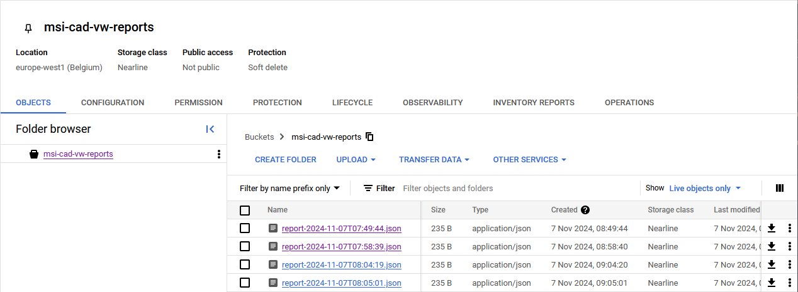

# User Login - Authentication

The User Login is done through the `Cloud Identiy Platform` by Google Cloud, which is the `cloud identity service`.
Here it is enabled to sign up new users with an E-Mail and a password.

In the Frontend, an interface was created, to check if a user is authenticated or to create a new user.

Furthermore, the returned Token should be used for a restricted or authorized usage.

# Functions as a Service

As a proof-of-concept, two FaaS were implemented.
The first takes the `Id` of a `Defect` and returns its status.
The second creates a `json` report listing all Defects that have been modified in the last hour.

## Defect Status query

The first FaaS can be used to query the status of a Defect.
Given the `Id`, it queries the database and returns the value and name of the associated status.
The `json` result has the following format:

```json
{
    "Id": "6d1b6e53-366e-4c64-a6a5-b779b7e808d8",
    "Value": 99,
    "Name": "Closed"
}
```

The `Id` field refers to the Defect's id that was used to query the status.
`Value` and `Name` refer to the Defect's status.
While `Value` is the numerical representation of the status, `Name` is the English description for easier use.

## Defect Modified Report

This FaaS is set up to create a report in `json` format that lists all the Defects having been changed in a given timeframe.
This timeframe, as well as the project's id and the collection, can be configured by the following environment variables.

```sh
PROJECT_ID="msi-cad-vw-staging"
COLLECTION_NAME="defects"
TIMEFAME="01:00:00"
```

The function also uploads the report to a separate storage bucket in `Object Storage`, if there are any changes to report.
If there are none, no report will be uploaded to save on storage size.
The `json` result for further processing, in case of a report being uploaded, has the following format.

```json
{
    "Count": 1,
    "Bucket": "msi-cad-vw-reports",
    "Name": "report-2024-11-07T07:58:39.json",
    "ContentType": "application/json"
}
```

The storage bucket setup and its contents can be seen in the following image.



As can be seen, the bucket is also set up with storage class `Nearline`.
This optimizes the file storage for backup datatype with less accesses, while also coming at a cheaper rate per GB and month.

Furthermore, this FaaS is connected to `Cloud Scheduler` in order to execute it once every hour.
This way, an hourly report of all changes to the `Defects` collection can be achieved.
