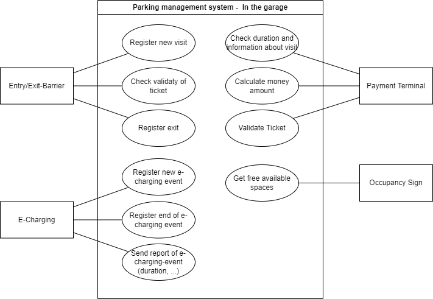

# Architecture Description

## Main Features and Scope

### System Context

### Use Case Diagram - Frontend Parking Management

#### Actors

* **Manager**: Owner and Manager of the parking garage. This person wants a good overview of the parking garage, its occupancy and the different devices.
* **Facility Manager**: Wants to know about problems, devices and defects inside of the parking garage.
* **Visitor**: Wants to know about the occupancy of the parking garage.

#### User Stories

1. As Manager, I want to get an overview of my parking garages. I want to be able to see all of them, add new parking garages to the current management and add rooms, parking spaces and similar things to the parking garage.
2. As Manager, I want to handle users of my parking management system. I want to add new ones and grant permissions.
3. As Manager, I want to get a good overview of all my properties. Additionally, I want to see if there are defects.
4. As Manager, I want to get information about the system (e.g. uptime, failed requests, request time).
5. As Facility Manager, I want to get an overview of the defects and resolve them.
6. As Manager, I want to see all parking spaces, the current occupancy (including peak times and reports) and reserve, manage or configure the spaces.
7. As Manager, I want to get an overview of the exit / entry barriers and see the current status and usage amount.
8. As Manager, I want to see my payment terminals, their status and of course the earned money. Additionally, I want to configure my terminals.
9.  As Manager, I want to see the E-Charging terminal list and the current status.
10. As a Visitor, I want to see the costs of the parking garage and the current occupancy.
11. As a Visitor, I want to be able to report defects.
12. As a logged-in Visitor, I want to reserve parking spots.

### Use Case Diagram - In the Parking Garage

Inside of the parking garage, there are other "users".
The visitor itself, who is a person that wants to park inside the garage, and a lot of facilities, that communicate with the parking management software, to manage the user.

In this case, the visitor wants to do the following things:

1. As a visitor, I want to be able to enter the garage and receive a ticket from the entry barrier. Therefore, my visit needs to be stored within the parking management service.
2. As a visitor, I want to be able to pay for my visit. Therefore, the spent time and the resulting costs need to be calculated, I have to pay and the result will be stored in the database.
3. As a visitor, I want to leave the parking garage after my visit. Therefore, my ticket needs to be checked.
4. As a visitor, I want to see the current occupancy of the parking garage on a display.

### Additional requirements

1. Authentication and Authorization
2. Self-Registration of Tenants with tenant management
3. Customization for each Tenant
4. Pricing models for the tenants (goal: dynamic pricing for the tenants)
5. Security with IAM (e.g. one service account per tenant/service)
6. CI/CD-Pipeline
7. Separate Staging and productive environment

## Architecture

### Components

In the following diagram, all services are listed.

The components are:

- **Keycloak**: Authentication Service to manage the tenants, users and authorization
- **Frontend**: User Interface that presents all important components and artefacts
- **Interface / API-Gateway**: Service to check the requests, validate the tokens and grant access to the services behind.
- **Parking garage management**: Property Management for the entire garage. A lot of information can be requested (e.g. location, name, parking spaces, ...)
- **Defect Management**: Management of Defects and problems. Important for the facility manager
- **Facility Management:** Facilities within the building, e.g. exit/entry barriers, terminals or occupancy signs
- **Parking Management**: Current state, ticket management and parking management. 

### Data Management

Each microservice has a plan for data structure and stored data in the database.
Reference the image below for detailed information.

### Sequence

#### User enters parking garage

#### User uses the terminal

#### User leaves the parking garage

### Asynchronous: Generate reports

### Asynchronous: Show occupancy

## Multi Tenancy

### Tenant Types

There are three types of tenants with different features

- **Free**: No Price, Best Effort, No Customization, Shared
- **Standard**: Attractive Price, SLA, Few Customization, Shared/Pooled
- **Enterprise**: Premium Price, SLA, Highly Customizable, High Isolation

### Access and Features by Tenant Type

| Feature                    | Free                                          | Standard                                               | Enterprise         |
| -------------------------- | --------------------------------------------- | ------------------------------------------------------ | ------------------ |
| Number of parking garages  | 1                                             | 5                                                      | unlimited          |
| Number of parking spaces   | max. 1000                                     | unlimited                                              | unlimited          |
| Type of parking spaces     | no special parking spaces                     | Standard, Women, Family, Disabled, E-Parking           | configurable       |
| Hardware APIs              | limited                                       | most supported                                         | all supported      |
| E-Charging                 | -                                             | possible                                               | possible           |
| Defect management          | -                                             | no status no comments no user feedback           | unlimited          |
| Reports                    | -                                             | limited                                                | unlimited          |
| Roles                      | no Facility Manager                           | all                                                    | all                |
| Landing-page prioritization| none                                          | medium                                                 | high               |
| Advertising                | a lot                                         | none                                                   | none               |
|                            |                                               |                                                        |                    |
| **Customization**          |                                               |                                                        |                    |
| Parking prices             | one price                                     | day/night                                              | fully customizable |
| Color scheme               | fixed                                         | color selection                                        | unlimited          |
|                            |                                               |                                                        |                    |
| **Hardware**               |                                               |                                                        |                    |
| Databases                  | one collection (per service) for all customers| one collection (per tenant)                         | dedicated database |
| Scaling                    | barely scaled                                 | scaled                                                 | very well scaled   |
| Shared resources           | all                                           | all, except databases have dedicated collections       | none               |

### Tenants in Hardware

