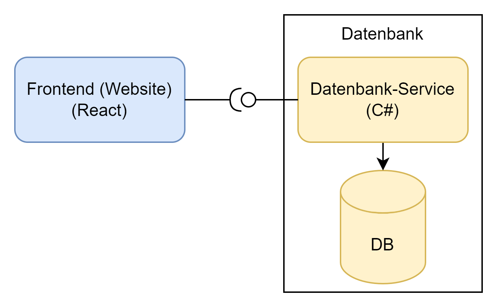

# Parking Management Cloud Application

This SaaS application was built as part of the "Cloud Application Development" lecture at HTWG Konstanz.
The repositories and sourcecode can be accessed [on GitHub](https://github.com/msi-cad-vw).
Students involved in the development:

* [Maren Franke](mailto:ma452fra@htwg-konstanz.de)
* [Elisha Leoncio Leon](mailto:el871leo@htwg-konstanz.de)
* [Nico Riedlinger](mailto:ni911rie@htwg-konstanz.de)

## System Architecture

The system's architecture is split into Frontend and Backend, consisting of several microservices.
Also part of the backend is a MongoDB database for persistent data storage.

Every service is containerized and run in Docker environment.
The underlying operating system is Ubuntu 22.04.

### Frontend Service

The Frontend Service provides the actual website pages that the User may interact with.
It is written using ReactJS and can retrieve data from the database by calling the Database Service in the Backend through a REST API.
For ease of use, the Frontend Service is containerized in a Docker container.
It is hosted by an nginx-server.

### Database Service

The Database Service is implemented in C# and .NET 8.0.
Being a kind of "middleware", it contains business logic to save and retrieve data to and from the database while validating it.
For startup, the service is containerized using a Dockerfile and run in the Docker environment.

### Database

MongoDB is used as the database engine for persistent data storage.
Like other services, MongoDB is directly installed to the Docker environment.
This can be done using the official image [provided by Dockerhub](https://hub.docker.com/r/mongodb/mongodb-community-server).

## Local Setup

With the `docker-compose.yml` file, you can easily start the application on a local machine. Therefore you have to do the following steps:
1. Create a new folder (e.g. `Cloud`)
2. Clone all repositories into this folder (`database`, `frontend-main` and `.github`)
3. Copy the `docker-compose.yml` out of the `.github/local_setup` folder into the root folder (in our example `Cloud`): `cp .github/local_setup/docker_compose.yml .`
4. Build the frontend-application (for further information check the `README.md` in `frontend-main`)
5. Execute `docker compose up --build -d` and wait
6. (optional) Copy the `restart.sh` out of the `.github/local_setup` and make the restart of the system really easy
