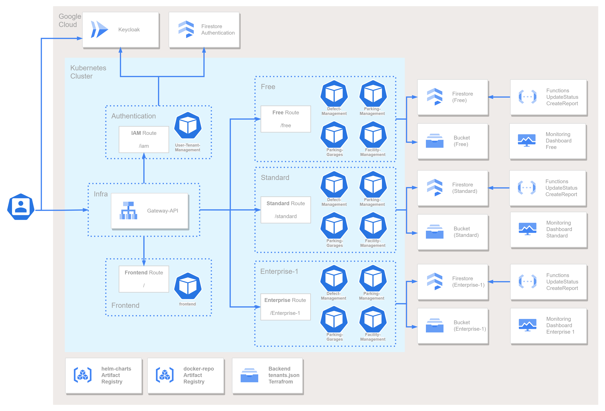

# Parking Management Cloud Application  [DEPRECATED]

This PaaS application was built as part of the lecture "Cloud Application Development" at HTWG Konstanz.
A demo version is available [on Google Cloud](https://msi-cad-vw-frontend-103924362067.europe-west1.run.app).
The repositories and sourcecode can be accessed [on GitHub](https://github.com/msi-cad-vw).  
Students involved in the development:

* [Maren Franke](mailto:ma452fra@htwg-konstanz.de)
* [Elisha Leoncio](mailto:el871leo@htwg-konstanz.de)
* [Nico Riedlinger](mailto:ni911rie@htwg-konstanz.de)


## System Architecture

The system's architecture is split into Frontend and Backend, consisting of several microservices.
Also part of the backend is a NoSQL database, hosted by Google Cloud Firestore.



### Frontend Service

The Frontend Service provides the actual website pages that the User may interact with.
It is written using ReactJS and can retrieve data from the database by calling the Database Service in the Backend through a REST API.
For ease of use, the Frontend Service is containerized in a Docker container.
It is hosted by an nginx-server.

### Database Service

The Database Service is implemented in C# and .NET 8.0.
Being a kind of "middleware", it contains business logic to save and retrieve data to and from the database while validating it.
For startup, the service is containerized using a Dockerfile and run in the Docker environment.

### Database

The database is a "NoSQL"-Database made up of the collection "defects" with the documents for the different reports.
An example defect document looks like this:

```json
{
  "Id": "670fad0c5f0077e4f8cf7633",
  "Title": "Einfahrtsschranke defekt",
  "Description": "Die Einfahrtsschranke öffnet sich nicht ordnugsgemäß.",
  "Date": "2024-10-28T12:09:48.462Z",
  "Status": 10,
  "Object": "Einfahrtsschranke",
  "Location": "Einfahrt Nord",
  "ImageName": "670fad0c5f0077e4f8cf7633"
}
```

## Google Cloud

The complete PaaS is hosted on Google Cloud.
While the microservices must be deployed manually, MongoDB is hosted and configured by MongoDB Atlas on Google Cloud.

### Microservices

The microservices are run on Google Cloud.
For startup, first make sure to enter valid host addresses as environment variables in the script `google_cloud_push.sh`.
After that, execute this script and the services will be built and deployed to Google Cloud automatically.

Startup: Execute `google_cloud_push.sh`
1. Database Service
   1. Builds Database API Service Image
   2. Pushes the built Image to Google Cloud
   3. Runs the Image and creates the container on Google Cloud
2. Frontend Service
   1. Builds the Frontend Image based on the Dockerfile with a creation argument (URL)
   2. Pushes the Frontend Image to Google Cloud
   3. Runs the Image and creates the container on Google Cloud

### Firestore

The database is not outsourced to a "NoSQL" in Firebase on Google Cloud.

To setup the database on Google, the following steps have to be done, based on this [description](https://firebase.google.com/docs/firestore/quickstart).
1. Setup Firestore Database (Name `(default)` for no extra costs)
2. Setup Development Environment:
   1. Configure local: `gcloud auth application-default login`
   2. Save the data in a local file and execute `export GOOGLE_APPLICATION_CREDENTIALS="KEY_PATH"` with `KEY_PATH` being the path to this file.
   3. Copy the file to a path, that can be linked as `env-variable` in the Docker-Compose or the `execute_locally.sh`
3. Configure everything in the `C#` Code

### Object Storage

Large files (i. e. images) are persistently stored in Google Object Storage.

To setup the object storage (buckets), the following steps have to be done:
1. Create a bucket: `msi-cad-vw-bucket`
2. Add a Service Account with the Role `Storage Object Viewer` (and an `Owner` Role (not best practice))
3. Add a key to the Service Account and download the `JSON-File`
4. Local setup: 
   1. Link the Service account with the environment variable, pointing to the file
   2. Start the database-container with: `docker run --volume /home/maren/.config/gcloud:/var/lib --env GOOGLE_APPLICATION_CREDENTIALS=/var/lib/application_default_credentials.json --env GOOGLE_SERVICE_ACCOUNT_CREDENTIALS=/var/lib/msi-cad-vw-private-key.json  -p 8080:8080 cloud-database`
5. Setup in Cloud:
   1. Configure a secret with the `private-key` (JSON-File)
   2. Set the secret as a volume: https://cloud.google.com/run/docs/configuring/services/secrets#console
   3. Optional: Set an environment variable to the volume
   4. Link the Service account to the `gcloud-volume` path: `mnt/secret/msi-cad-vw-secret`


### Steps to setup a new dev-project
1. Enable APIs
   1. Cloud Resource Manager API: https://console.cloud.google.com/apis/api/cloudresourcemanager.googleapis.com/metrics?project=msi-cad-vw-staging
   2. Docker and Artifact Registry API: https://console.cloud.google.com/apis/library/artifactregistry.googleapis.com?project=msi-cad-vw-staging
         ```bash
         gcloud services enable artifactregistry.googleapis.com
         gcloud artifacts repositories create docker-repo --repository-format=docker --location=europe-west1 --description="Docker repository for msi-cad-vw-staging"
         gcloud auth configure-docker europe-west1-docker.pkg.dev
         gcloud services enable run.googleapis.com
         ```
   3. 
2. Setup service-account for the new project
   - `gcloud iam service-accounts create msi-cad-vw-staging-account`
   - `gcloud iam service-accounts keys create complaint-images-read-key.json --iam-account msi-cad-vw-staging-account@msi-cad-vw-staging.iam.gserviceaccount.com`
   - `gcloud auth login`
   - `gcloud projects add-iam-policy-binding msi-cad-vw-staging --member="serviceAccount:msi-cad-vw-staging-account@msi-cad-vw-staging.iam.gserviceaccount.com" --role="roles/owner"`
   - `gcloud auth activate-service-account msi-cad-vw-staging-account@msi-cad-vw-staging.iam.gserviceaccount.com --key-file=./complaint-images-read-key.json`
3. Setup firestore database (in Console)
   1. Create DB
      - Name: `(default)`
      - Region: `europe-west1 (Belgium)`
   2. Configure DB
      1. Add Collection: `defects`
      2. Add first object with "GUID" as Document-ID and a correct `defects`-entry
4. Setup Bucket
   1. Create Bucket: `gcloud storage buckets create gs://msi-cad-vw-staging-bucket --project=msi-cad-vw-staging --default-storage-class=STANDARD --location=europe-west1`
5. Start container within the new project
6. Add secret
   1. Enable Secret Manager API
   2. Add secret wit JSON-File and Name: "msi-cad-vw-secret"
   3. Add Secret as Volume-Secret to "msi-ca-vw-secret"
   4. Add Mount-Path to Secret-Volume

Env-Variable:
- Firestore-DB Path
- Firestore-DB Name: (default)
- Bucket-Name: msi-cad-vw-staging-bucket
- Bucket-Path
