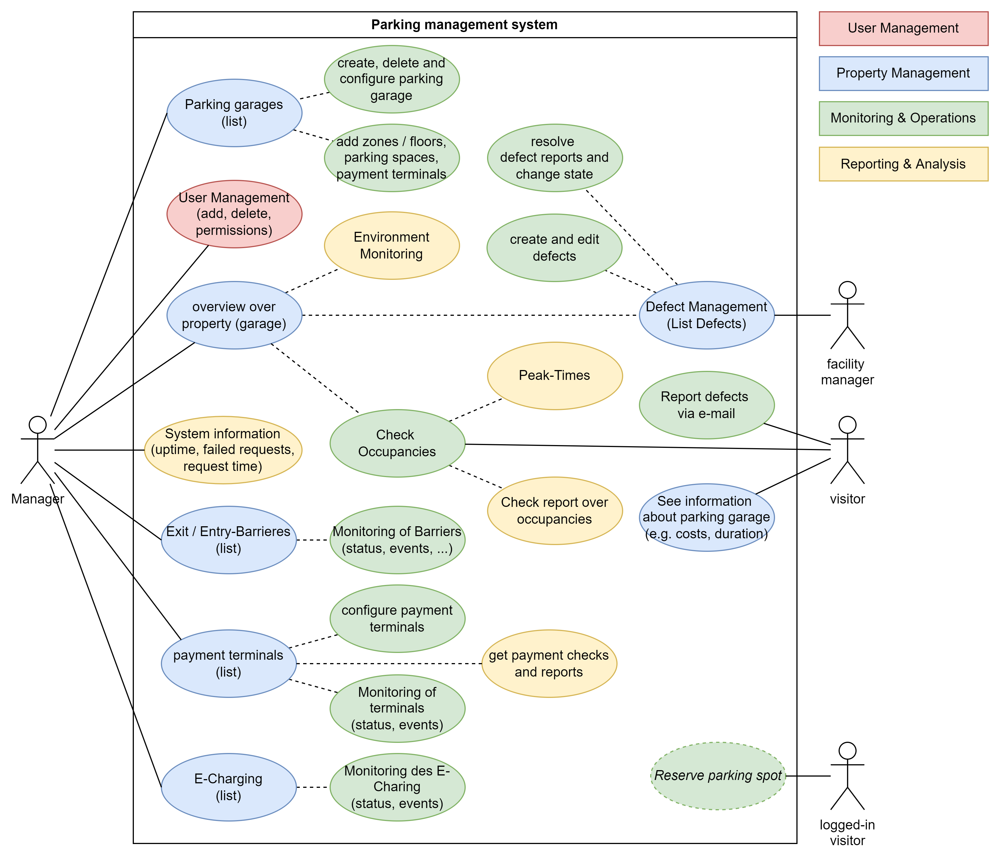

# Use Case

## Actors

**Manager**: Owner and Manager of the parking garage. This person wants a good overview over the parking garage, it occupancy and the different devices

**Facility Manager**: Wants to know about problems, devices and defects inside of the parking garage

**Visitor**: Wants to know about the occupancy of the parking garage

**Logged-In Visitor**: ???

## Use Case Diagram

## User Stories

1. As Manager, I want to get an overview over my parking garages. I want to be able to see all of them, add new parking garages to the current management and add rooms, parking spaces and similar things to the parking garage.
2. As Manager, I want to handle users of my parking management system. I want to add new ones and grand permissions.
3. As Manager, I want to get a good overview over all my properties. Additionally, I want to see, if there are defects.
4. As a Manager, I want to get information about the system (e.g. uptime, failed requests, request time).
5. As Facility Manager, I want to get an overview of the defects and resolve them.
6. As Manager, I want to see all parking spaces, the current occupancy (including peak-Times and reports) and reserve, manage or configure the spaces.
7. As Manager, I want to get an overview over the exit/ entry barriers and to see the current status and usage amount.
8. As Manager, I want to see my payment terminals, their status and of course the earned money. Additionally, I want to configure my terminals.
9.  As Manager, I want to see the E-Charging terminal list and the current status.
10. As a Visitor, I want to see the costs of the parking garage and the current occupancy.
11. As a visitor, I want to be able to report defects.
12. As a logged-in visitor I want to reserve parking spots.

### Addtional requirements

1. Authentication and Authorization
2. Self-Registration of Tenants with tenant management
3. Customization for each Tenant
4. Pricing models for the tenants (goal: dynamic pricing for the tenants)
5. Security with IAM (e.g. one service account per tenant/ service)
6. CI/CD-Pipeline
7. Separate Staging and productiv environment

## Multi-Tenancy
- **Free**: No Price, Best Effort, No Customisation, Shared
  - Parkhaus konfigurieren + Einfahrten / Ausfahrten
  - Keine separaten Datentrennung
  - *Beschränkungen in Applikation*:
    - nicht alle APIs der Terminals werden unterstützt
    - nur ein Parkhaus
    - kein E-Charging möglich
    - geringe Komplexität (bspw. keine unterschiedlichen Preise)
    - keine Facility-Manager-Role
    - keine Customization möglich
    - Festpreis für immer
    - begrenzte Anzahl an Parkplätzen
    - keine Reports möglich
  - *Hardware Beschränkung*
    - alle Tenants von Free teilen sich die gleichen Datenbanken/Collections
    - 
- **Standard**: Attractive Price, SLA, Few Customisation, Shared/Pooled
  - Mehrere Parkhäuser
  - Defekt-Verwaltung
  - eingeschränkte Customization (Farbgebung Frontend (vordefiniert), ...)
  - dynamic pricing
  - *Einschränkungen*:
    - nicht alle Reports einsehbar
    - Unterstützung nicht für alle Terminals möglich
    - keine Reservierungen möglich
    - Defekt Mangement: geringere Freiheiten (bspw. kein Status, keine Kommentare, keine Nutzer-Feedbacks)
- **Enterprise**: Premium Price, SLA, Highly Customisable, High Isolation
  - Alle Features der Anwendung
  - Customization (Farbgebung Frontend (own colors))
  - Datentrennung
  - Parkhäuser werden auf "visitor"-Seite oben angezeigt
  - Trennung von Datenbanken und Services für jeden Tentant
  - 
 